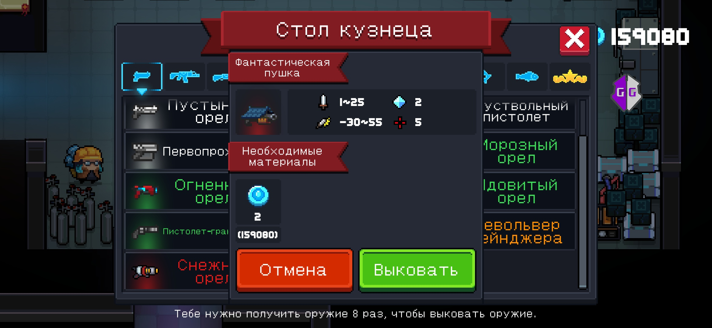
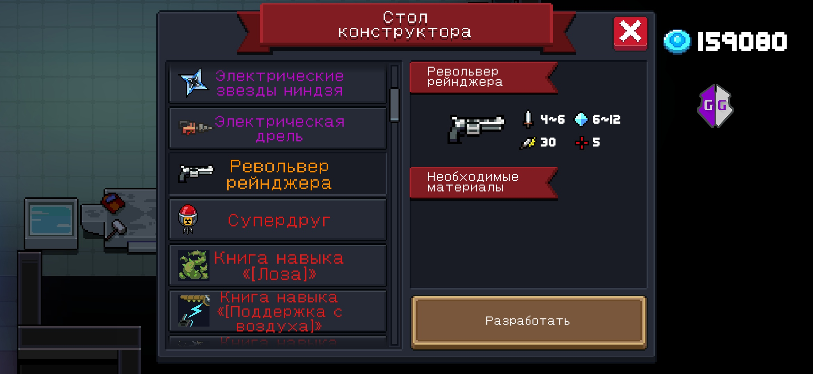
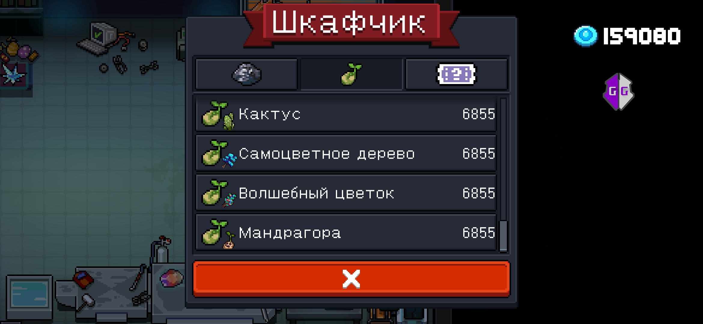
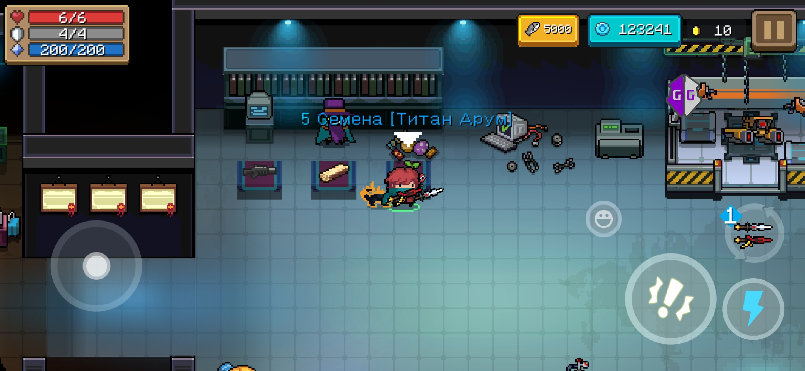
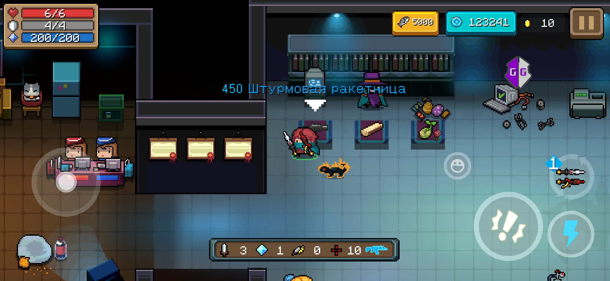
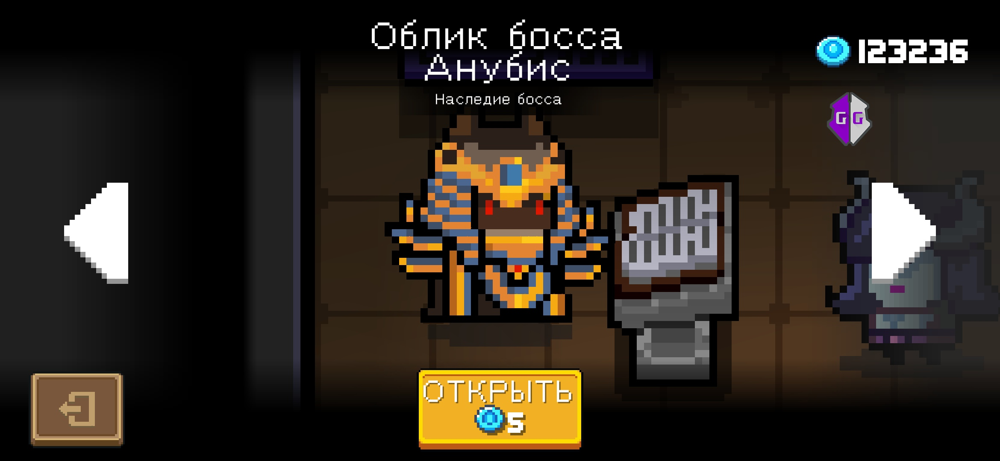

# SCRIPT FOR SOUL KNIGHT 

## ОПИСАНИЕ НА РУССКОМ
Данный скрипт только для игры Soul knight. Работает данный скрипт через программу [GameGuardian](https://gameguardian.net). Данный скрипт создан лишь для расширения игрового процесса и для помощи тем людям, которые не могут пройти тот или иной участок игры по определённым причинам.

Возможности скрипта

1. Может убрать почти все ингредиенты для крафта на столе кузнеца (п.с. перед этим надо хотя бы один рецепт посмотреть) (Функция: УБРАТЬ МАТЕРИАЛЫ С КУЗНЕЧНОГО СТОЛА)
>

Пример

2. Может убрать почти все ингредиенты из чертежа на столе конструктора (п.с. надо посмотреть все интересующие вас предметы, иначе ничего не произойдёт) (Функция: УБРАТЬ МАТЕРИАЛЫ СО СТОЛА КОНСТРУКТОРА)
>

Пример

3. Может разблокировать оружия все оружия на столе кузнеца. То есть вам не нужно искать оружия или изменять количество их подбора. (Применять надо строго при открытом столе)  (Функция: РАЗБЛОКИРОВАТЬ ВСЕ ОРУЖИЕ НА СТОЛЕ КУЗНЕЦА)
> [Пример использования ](https://youtu.be/7ZXoLIa39tc)
4. Может установить любое количество семян(затронет все семена, которые у вас были или уже есть ) (Функция: УСТАНОВИТЬ КОЛИЧЕСТВО СЕМЯН)
>

Пример

5. Может установить любое количество материалов (так же как и семенами, то есть затронет все материалы ) (Функция: УСТАНОВИТЬ КОЛИЧЕСТВО МАТЕРИАЛОВ)
6. Может установить любое количество купонов ( так же как и семенами, то есть затронет все купоны  ) (Функция: УСТАНОВИТЬ КОЛИЧЕСТВО КУПОНОВ)
7. Может установить почти любую цену для героев (не касается робота , оружейника и т.д. потому что их нельзя купить) (меняет цену почти у всех) (Функция: УСТАНОВИТЬ ЦЕНУ ДЛЯ ГЕРОЕВ)
8. Может установить почти любую цену для питомцев (так же как и с героями) (меняет цену почти у всех) (Функция: УСТАНОВИТЬ ЦЕНУ ДЛЯ ПИТОМЦЕВ)
9. Может установить почти любую цену для скиллов (меняет цену сразу для всех ) (Функция: УСТАНОВИТЬ ЦЕНУ ДЛЯ СКИЛЛОВ)
10. Может добавить почти любое количество золотых монет (Функция: ДОБАВИТЬ МОНЕТЫ)
11. Может изменить стоимость товара у торговца, которой торгует только за кристаллы(Функция: УСТАНОВИТЬ ЦЕНУ ТОВАРОВ У ПРОДАВЦА)
>

Пример

12. Может изменить стоимость всех скинов (Меняет цену у всех не доступных скинов ) (Функция: УСТАНОВИТЬ ЦЕНУ ДЛЯ СКИНОВ)
>

Пример

13. Может вырастить семена (Меняет состояние всех семян на максимальное) (Функция: ВЫРАСТИТЬ ВСЕ РАСТЕНИЯ)
14. Может изменить урон у оружия, что сейчас находятся в руках (Чтобы не вносить дисбаланс, на следующем уровне значения вернутся в изначальное состояние) (Функция: ОГРОМНЫЙ УРОН)
15. Может заставить игрока игнорировать стены (Чтобы не вносить дисбаланс при первом получении урона или на следующем уровне значения вернуться в изначальное состояние) (Функция: НЕТ СТЕН) 
>[Пример использования](https://youtu.be/W_2X7Nmvhho)
16. Может разблокировать все садовые участки (Для работы функции нужно разблокировать хотя бы один не бесплатный участок, 3 подойдёт, или разблокировать мотоцикл) (Функция: РАЗБЛОКИРОВАТЬ ВСЕ САДОВЫЕ УЧАСТКИ)
17. Может разблокировать мотоцикл (Для работы функции нужно разблокировать хотя бы один не бесплатный участок, 3 подойдёт) (Функция: РАЗБЛОКИРОВАТЬ МОТОЦИКЛ)
18. Может изменить уже созданные предметы на столе кузнеца (Для работы функции нужно создать хотя бы одно оружие) (Функция: ИЗМЕНИТЬ СОЗДАННЫЕ ПРЕДМЕТЫ НА СТОЛЕ КУЗНЕЦА) 
>[Пример использования](https://youtu.be/EwuaHsHxy6I)
19. Может обнулить количество попыток в Boss Rush (Функция: УБРАТЬ КОЛИЧЕСТВО ПОПЫТОК BOSS RUSH)
20. Может сбросить количество покупок у продавца (Функция: УБРАТЬ КОЛИЧЕСТВО ПОКУПОК У ПРОДАВЦА)
>[пример использования](https://youtu.be/cCPVSVR1AgI)
21. Может зарядить волновод (Функция: ЗАРЯДИТЬ ВОЛНОВОД)
22. Может добавить все возможные бафы (Функция: ДОБАВИТЬ ВСЕ БАФЫ)
23. Может увеличить уже имеющиеся атрибуты (Это всё то, что дают напитки) (Функция: УВЕЛИЧИТЬ ДОБАВЛЕННЫЕ АТРИБУТЫ)

## DESCRIPTION IN ENGLISH
This script is only for Soul knight. This script works via [GameGuardian](https://gameguardian.net). This script was created only to expand the gameplay and to help those people who cannot pass this or that part of the game for certain reasons.

Script Features

1. Can remove almost all the ingredients for crafting on the blacksmith's table (ps before that, you need to look at at least one recipe) (Function: REMOVE MATERIALS IN THE BLACKSMITH TABLE)
>

Example

2. It can remove almost all the ingredients from the drawing on the designer's table (P.S. you need to look at all the items you are interested in, otherwise nothing will happen) (Function: REMOVE MATERIALS FROM THE DESIGNER'S TABLE)
>

Example

3. Can unlock weapons all weapons on the blacksmith's table. That is, you do not need to search for weapons or change the number of their selection. (It should be used strictly when the table is open)  (Function: UNLOCK ALL WEAPON IN THE BLACKSMITH TABLE)
> [Usage example](https://youtu.be/7ZXoLIa39tc)
4. It can set any number of seeds(it will affect all the seeds that you have had or already have ) (Function: SET COUNT SEEDS)
>

Example

5. It can install any number of materials (as well as seeds, that is, it will affect all materials ) (Function: SET MATERIALS COUNT)
6. It can set any number of coupons ( as well as seeds, that is, it will affect all coupons ) (Function: SET TOKENS COUNT)
7. Can set almost any price for heroes (does not apply to a robot, a gunsmith, etc. because they can not be bought) (changes the price of almost everyone) (Function: SET HERO PRICE)
8. Can set almost any price for pets (as well as with heroes) (changes the price for almost everyone) (Function: SET PET PRICE)
9. Can set almost any price for skills (changes the price for all at once ) (Function: SET SKILL PRICE)
10. Can add almost any number of gold coins (Function: ADD COIN)
11. Can change the value of the goods from the merchant, which sells only for crystals (Function: SET THE PRICE OF ITEMS FROM THE MERCHANT)
>

Example

12. Can change the cost of all skins (Changes the price of all unavailable skins ) (Function: SET SKIN PRICE)
>

Example

13. Can grow seeds (Changes the state of all seeds to the maximum) (Function: GROW ALL THE SEEDS)
14. It can change the damage of weapons that are currently in the hands (In order not to introduce an imbalance, the values will return to their original state at the next level) (Function: HUGE DAMAGE)
15. Can force the player to ignore the walls (In order not to make an imbalance at the first damage or at the next level, the values return to their original state) (Function: NO WALLS) 
>[Usage example](https://youtu.be/W_2X7Nmvhho)
16. Can unlock all garden plots (For the function to work, you need to unlock at least one non-free plot, 3 will do, or unlock a motorcycle) (Function: UNLOCK ALL GARDEN PLOTS)
17. Can unlock a motorcycle (For the function to work, you need to unlock at least one non-free section, 3 will do) (Function: UNLOCK MOTORCYCLE)
18. Can change already created items on the blacksmith's table (For the function to work, you need to create at least one weapon) (Function: CHANGE THE CREATED ITEMS ON THE BLACKSMITH'S TABLE)
>[Usage example](https://youtu.be/EwuaHsHxy6I)
19. Can reset the number of attempts in Boss Rush (Function: REMOVE THE NUMBER OF BOSS RUSH ATTEMPTS)
20. Can reset the number of purchases from the seller (Function: RESET SELLER)
>[Usage example](https://youtu.be/cCPVSVR1AgI)
21. Can charge the waveguide (Function: CHARGE THE WAVEGUIDE)
22. Can add all possible buffs (Function: ADD ALL BUFFS)
23. Can increase already existing attributes (This is all that drinks give) (Function: INCREASE ADDED ATTRIBUTES)

